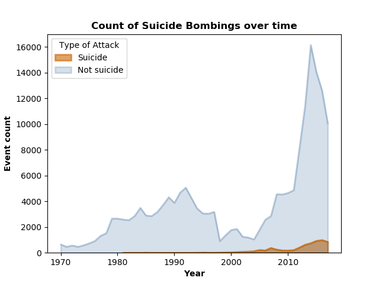
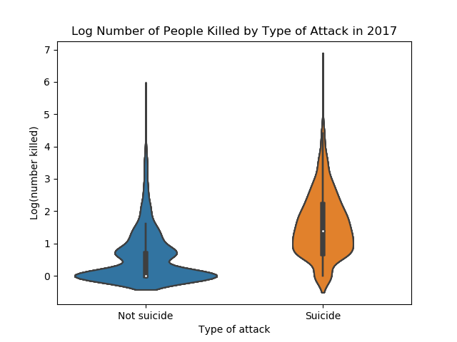
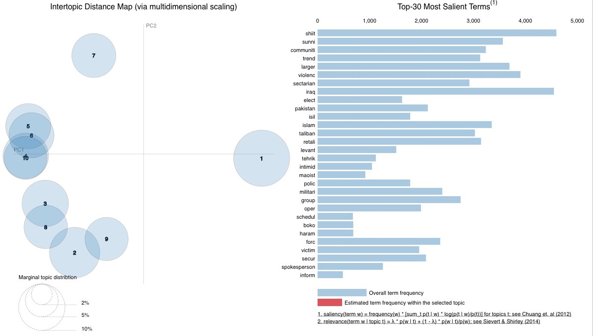
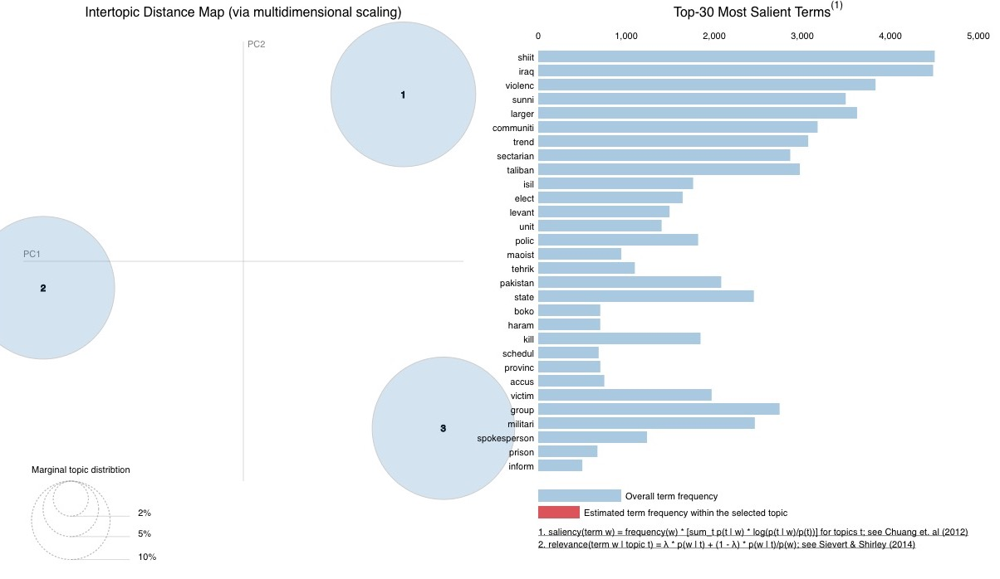
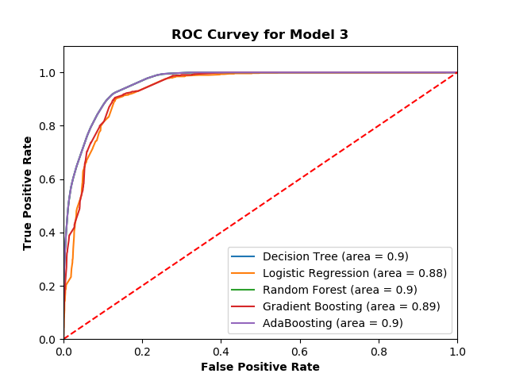
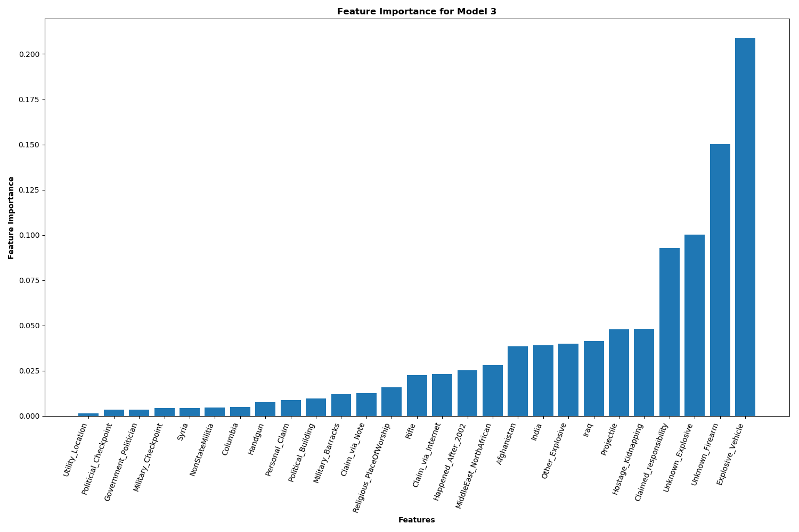

# Modeling Suicide Bombings
## Jane Stout, Ph.D.

### Background

Suicide bombings are much less common than other types of terrorist attacks. Figure 1 shows a plot of suicide bombings vs. non-suicide bombings over time.

**Figure 1. Suicide vs. Non-Suicide Bombings Over Time**

Further, suicide bombings tend to be concentrated in specific countries; most countries do not experience suicide bombings as a form of terrorism. Figure 2 displays a heatmap of suicide bombings that occurred in 2017.

**Figure 2. Heatmap of Suicide Bombings in 2017**

Nonetheless, suicide bombings are more deadly than other forms of terrorism; see Figure 3 for a plot of the number of people killed in suicide bombings versus non-suicide bombings in 2017 alone. Moreover, this type of terrorist attack (along with terrorism in general), is increasingly prevalent over time (see growth in terorrism prevalence across time in Figure 1).

**Figure 3. Log Number of Poeple Killed by Suicide vs. Non-Suicide Bombings in 2017**

*Note. Given that the data were heavily skewed right, the data were transformed by adding 1 and then taking the log of each datapoint.*

### Project Goals
- Understand situations/contexts in which suicide bombings occur
- Build a model that accurately predicts when a terrorist attack is a suicide bombing or not
  - Focus on *Recall*: Generate a model with very few false negatives
- Interpret my final model's feature importances in order to predict future suicide bombings

### Data Source

The Global Terrorism Database (GTD) is an open-source database including information on terrorist events around the world from 1970 through 2017. Unlike many other event databases, the GTD includes systematic data on domestic as well as transnational and international terrorist incidents that have occurred during this time period and now includes more than 180,000 cases. For each GTD incident, information is available on the date and location of the incident, the weapons used and nature of the target, the number of casualties, and--when identifiable--the group or individual responsible.

One variable in the GTD is whether a given terorrism event was due to a suicide bombing. This project used machine learning to model features affiliated with suicide bombing using the GTD.

### Exploratory Data Anslysis

To identify features for my model, I systematically assessed whether all variables in the [codebook] might relate to suicide bombing at a theoretical level (e.g., weapon type likely predicts suiciding bombing, but month of the year likely does not). Then, I ran descriptive statistics on relevant variables e.g., I ran crosstabs on categorical feature: Weapon Type (multi-categorical variable) and Suicide Bombing (binary variable), and observed the magnitude of differences in feature prevalence for suicide bombings versus non-suicide bombings. If features showed a noteable difference in magnitude, I created a binary variable for that feature (e.g., specific weapon type: truck explosive (1) vs. not truck explosive (0)) for the forthcoming Decision Tree model. In total, I identified 27 features for the model (see Table 1 for details).

**Table 1. Feature Labels, Definitions, and Direction of Difference by Attack Type**

| Feature label           | Definition                                                                          | Suicide > Not Suicide |
|--------------------------|-------------------------------------------------------------------------------------|-----------------------|
| Utility_Location         | The target of the attack was an electric utility location                           |                       |
| NonStateMilitia          | The target of the attack was a terrorist/non-state militia organization             | X                     |
| Military_Checkpoint      | The target of the attack was a military checkpoint                                  | X                     |
| Government_Politician    | The target of the attack was a politician or political party movement/meeting/rally | x                     |
| Syria                    | Incident location was Syria                                                         | X                     |
| Columbia                 | Incident location was Columbia                                                      |                       |
| Handgun                  | The weapon was a handgun                                                            |                       |
| Personal_Claim           | The incident was a "personal claim"                                                 | x                     |
| Police_Building          | The target of the attack was a police building                                      | x                     |
| Police_Checkpoint        | The target of the attack was a police checkpoint                                    | x                     |
| Claim_via_Note           | The incident was claimed via a note left at the scene                               |                       |
| Military_Barracks        | The target of the attack was military barracks/base/headquarters/checkpost          | x                     |
| Religious_PlaceOfWorship | The target of the attack was a religious place of worship                           | x                     |
| Rifle                    | The weapon was a rifle                                                              |                       |
| Claim_via_Internet       | The incident was claimed by posting to a website, blog, or social media             | X                     |
| Happened_After_2002      | The incident took place after 2003 or later                                         | X                     |
| MiddleEast_NorthAfrican  | Incident location was in the Middle East/North Afria                                | X                     |
| India                    | Incident location was India                                                         |                       |
| Other_Explosive          | The weapon was an other (unclassified) explosive type                               |                       |
| Afghanistan              | Incident location was Afghanistan                                                   | X                     |
| Iraq                     | Incident location was Iraq                                                          | X                     |
| Projectile               | The weapon was an explosive projectile (e.g., rocket, mortar)                       |                       |
| Hostage_Kidnapping       | Victims of the attack were taken hostage or kidnapped                               |                       |
| Claimed_responsibility   | The terrorist group claimed responsibility                                          | X                     |
| Unknown_Explosive        | The weapon was an unknown explosive type                                            |                       |
| Unknown_Firearm          | The weapon was an unknown gun type                                                  |                       |
| Explosive_Vehicle        | The weapon was an explosive vehicle                                                 | X                     |

*Note. An X in the "Suicide > Not Suicide" column indicates a given feature was more prevalent in suicide bombings than in non-suicide bombings. The direction of the difference was determinted via exploratory data analysis prior to modeling.*

### Data Preparation

#### Class Imbalance
As seen in Figure 1, there is severe class imbalance in my target variable, which is the proportion of total terrorist attacks that are suicide bombings. To deal with class imbalance, I explored downsampling and upsampling methods. Downsampling involves taking a random samble of the majority classification (non-suicide bombings) that is the same size as the minority classification (suicide bombings). Conversely, upsampling matches the number of samples in the majority class with resampling from the minority class. The *Model Comparison: Class Imbalance Strategies and Features* section discusses this comparison in detail. I implemented listwise deletion for missing values in the dataframe, resulting in N = 5134 (n = 2567 in each group) for the downsampled dataframe and N = 92,554 (n = 46277 in each group) for the upsampled dataframe.

#### Train/Test Dataframes

For both downsampled and upsampled dataframes, I generated a training and testing dataframe using the sklearn.model_selection.train_test_split method. I used a 75:25 (train:test) split on the data.

### Latent Dirichlet Allocation (LDA)

Next, I sought to use an unsupervised learning technique to create underlying topics in a text variable in the dataset called "Motive". According to the GTD codebook, "When reports explicitly mention a specific motive for the attack, this motive is recorded in the “Motive” field. This field may also include general information about the political, social, or economic climate at the time of the attack if considered relevant to the motivation underlying the incident." For both the "training" and "testing" class-balanced dataframes, I used LDA to generate latent topics for motives. LDA, based on word frequency within a document set, is used to classify text in a documents into topics.

#### Example motives:

+ *The **specific motive is unknown**; however, sources speculated that the attack, which targeted Shiite Muslims, is part of a larger trend of sectarian violence between Iraq's **Shiite** majority and **Sunni** minority communities.*
+ *Specific motive is unknown; however, Al-Qassam Brigades **claimed responsibility** for the incident and they often attack Israeli civilians and soldiers.*
+ *The Communist Party of India - Maoist (CPI-Maoist) claimed responsibility for the incident and stated that the attack was carried out in **protest of United States President Barack Obama's upcoming visit** to India for Republic Day celebrations, scheduled for January 26, 2015.*
+ *Two notes found with Bashar, the suicide bomber in the related case (cf. 200511290002), indicated that the attack was a **preliminary warning** to the forces working to ensure the security of judges and announced the continuation of Jihad until an Islamic welfare state was established in Bangladesh.*  

In addition to using gensim's stopwords, I used the following set of stopwords/stop-phrase relevant to terorrist attacks:
- 'attack', 'bomb', 'bomber', 'bombing', 'carried', 'claim', 'claimed', 'however', 'incident', 'majority', 'minority' 'motive', 'noted', 'responsibility', 'sources', 'specific', 'speculate', 'speculated', 'State', 'state', 'stated', 'statement', 'States', 'suicide', 'target', 'targeted', 'targeting', 'Unknown', 'unknown'
- 'The specific motive for the attack is unknown.'

To determine an optimal number of latent topics, I plotted Coherence Scores (higher is better) for a range of 1-10 topics (see Figure 4). The plot showed two trends:
1. Two topics were optimal, with a coherence score of .39
2. Coherence increased as the number of topics increased

**Figure 4. LDA Coherence Scores for a Range of 1-10 Topics**

When I inspected a visual representation of latent 10 topics (see Figure 5), I noted the clustering looked most like a three topic pattern. Modeling with 10 topics had a coherence score .35.

**Figure 5. A Visualzation of an LDA Model with 10 Latent Topics**

Thus, I opted to model the data using three clusters (see Figure 6); this model had a coherence score of .30.

**Figure 6. A Visualzation of an LDA Model with 3 Latent Topics**

After generating LDA scores for three topics for each case in both the training and testing dataframes, I merged the LDA scores into the original training and testing dataframes. Note that cases were dropped that did not have LDA scores (i.e., text in the motive column consisted only of stopwords/stop phrases).

### Modelling

I ran a series of 10 Decision Tree models, using different iterations of class imbalance strategies and features (see Table 2). I observed Accuracy, Recall, and Precision in order to select the optimal model. I focused particularly on Recall, which is an important index for predicting suicide bombings. That is, it is important to "catch" the highest number of suicide bombings possible, which is reflected by the Recall score.

#### Model Comparison: Class Imbalance Strategies and Features
**Table 2. Decision Tree Statistics and Model Characteristics**

|          |Class imbalance   strategy | LDA topics   in model| Feature   importance   threshold | Accuracy | Recall | Precision | N size   (testing) |
|----------|------------|----------|-----|----------|--------|-----------|-------------|
| Model 1 |downsampling|   | 0     | .86     | .83   | .88      | 544        |
| Model 2 |downsampling| X | 0     | .81     | .75   | .85      | 542        |
| Model 3 |upsampling  |   | 0     | .90     | .92   | .88      | 9590       |
| Model 4 |upsampling  |   | <= .02| .87     | .88   | .87      | 9590       |
| Model 5 |upsampling  |   | <= .03| .86     | .88   | .85      | 9590       |
| Model 6 |upsampling  |   | <= .08| .78     | .79   | .78      | 9590       |
| Model 7 |upsampling  | X | 0     | .84     | .83   | .83      | 9590       |
| Model 8 |upsampling  | X | <= .02| .81     | .81   | .81      | 9590       |
| Model 9 |upsampling  | X | <= .03| .80     | .80   | .79      | 9590       |
| Model 10|upsampling  | X | <= .08| .71     | .70   | .70      | 9590       |

A tree diagram of Model 6 is displayed in Figure 7. This diagram gives a sense for how Decision Trees work. However, Model 6 is an over-simpoified model. A better model is Model 3, which is displayed in Figure 8. This figure shows a much more complex model that is no longer easy to intepret visually.

**Figure 7. A Tree Diagram of Model 6**

**Figure 8. A Tree Diagree of Model 3**

#### Model Comparison: Algorithms

I selected Model 3 for the next phase of model testing because this model had the highest Recall score of all of the models. Next, I ran Model 3 through a series of algorithms (see Table 3 and Figure 10) I found that model fit statistics did not differ substantively across models.

**Table 3. Model Statistics and Hyperparameters for Algorithms**

|                     | Hyperparameters             | Accuracy | Recall | Precision |
|---------------------|-----------------------------|----------|--------|-----------|
| Decision Tree       |                             | .90      | .92    | .88       |
| Logistic Regression |                             | .88      | .92    | .85       |
| Random Forest       | 100 trees                   | .90      | .92    | .88       |
| Gradient Boosting   | 100 trees, .1 learning rate | .89      | .90    | .87       |
| AdaBoosting         | 100 trees, .1 learning rate | .90      | .92    | .88       |

**Figure 10. ROC Curves for Five Algorithms Testing Model 3.**

Using a Random Forest Classification, I created a confusion matrix (Figure 11) and displayed feature importances (Figure 12).

**Figure 11. Confusion Matrix for Model 3 Using Random Forest Classification.**

**Figure 12. Feature Importances for Model 3 Using Random Forest Classification**

### Interpreting Feature Importance
We can use feature importances (see Figure 11) and directional effects observed during EDA (see Table 1) to make assumptions about suicide bombing. The most important feature was whether or not an explosive in a vehicle was used; suicide bombings are particularly likely to use this type of weapon. Terrorist groups that use suicide bombing are also particularly likely to claim responsibility for the incident, suggesting they seek noteriety for their deeds. That is, these groups are forthcoming and tend not to hide in the shadows. Finally, suicide bombings are more likely than other types of terrorist attacks in Afghanistan and Iraq. Taken together, this suite of characteristics suggests authorities and individuals should **be cautious in Irah and Afghanistan** and be particularly **vigilent in areas that have a high density of vehicles**. Authorities should **monitor terriost groups that have claimed responsibility** for suicide bombings in the past.

### Future Directions

#### Theoretical
- Consider other data sources to merge into GTD that could help explain suicide bombings
- Model domestic forms of terrorism (i.e., in the United States)

#### Technical
- Run Regularized Logistic Regression Analyses
- Then, do a grid search on hypter parameters for the final algorithm I select.
- Refactor my code so that is uses classes rather than functions.

[codebook]: https://www.start.umd.edu/gtd/downloads/Codebook.pdf
